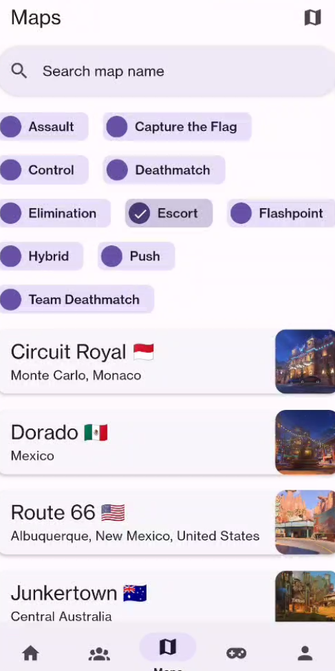

# Infowatch

Mobile/web app for viewing information on Overwatch heroes, maps, modes, and users.

## About

Infowatch is built using React Native.

## Features

A brief overview of major features of Infowatch:

1. Hero details
2. Map details
3. Game mode details
4. Player search
5. Player competitive details
6. Dark mode

### Hero details

### Map details

### Game mode details

## Screenshots

## Video Demo

<!-- <video width="270" height="540" controls>
  <source src="https://github.com/ThaiDuongVu/infowatch/raw/refs/heads/main/media/video.mp4" type="video/mp4">
</video> -->
<iframe src="https://drive.google.com/file/d/1ESJuyyGHkHCW_TDi_V_7zhWMJPRmYQub/preview" width="640" height="480" allow="autoplay"></iframe>
